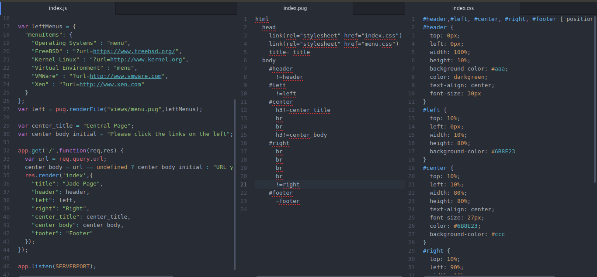
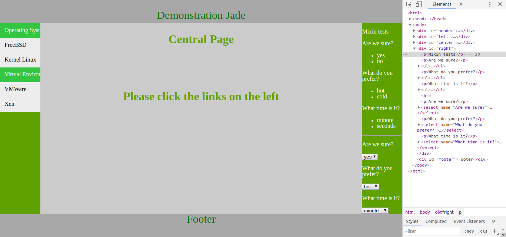

# Jade/Pug
Useful examples on Jade template engine
Pug is the new name for Jade Project

# Install
```
  apt install node npm 
  mkdir jade
  cd jade
  npm init
  npm install express pug
```
# Use
```
  cd jade
  ./index.js
```
# Working
1. source on nodejs (index.js)
2. template file (index.pug)
3. CSS file (index.css)


# Output
1. HTML layout on browser
2. Source HTML

