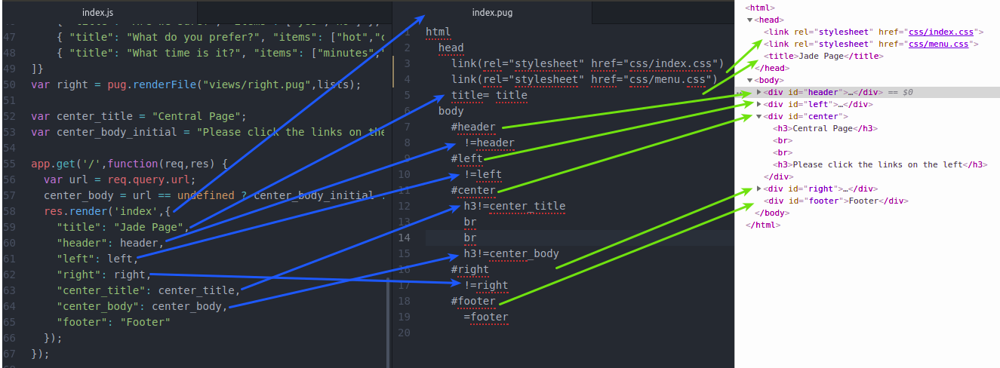
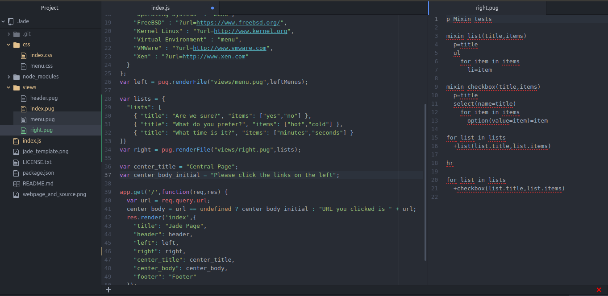
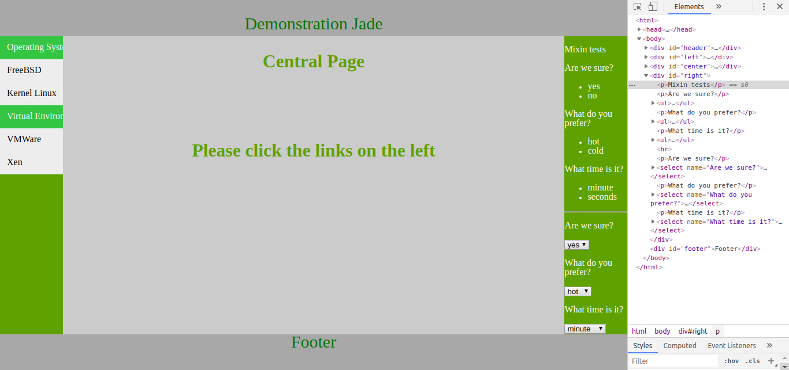
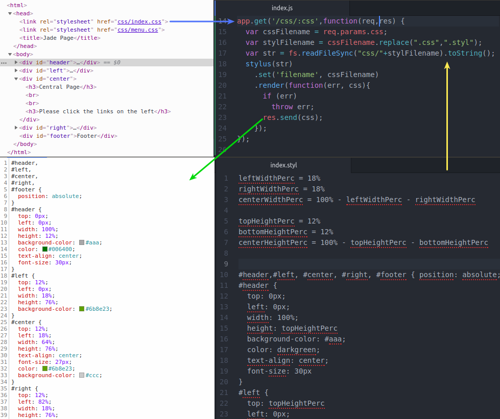

# Jade/Pug
Useful examples on Jade template engine.

Pug is the new name for Jade Project

# Install
```
  apt install node npm
  mkdir Jade
  cd Jade
  npm init
  npm install express pug stylus
```
# Use
```
  cd Jade
  ./index.js
```
# Working
1. template using jade

2. mixin jade feature


3. stylus css

